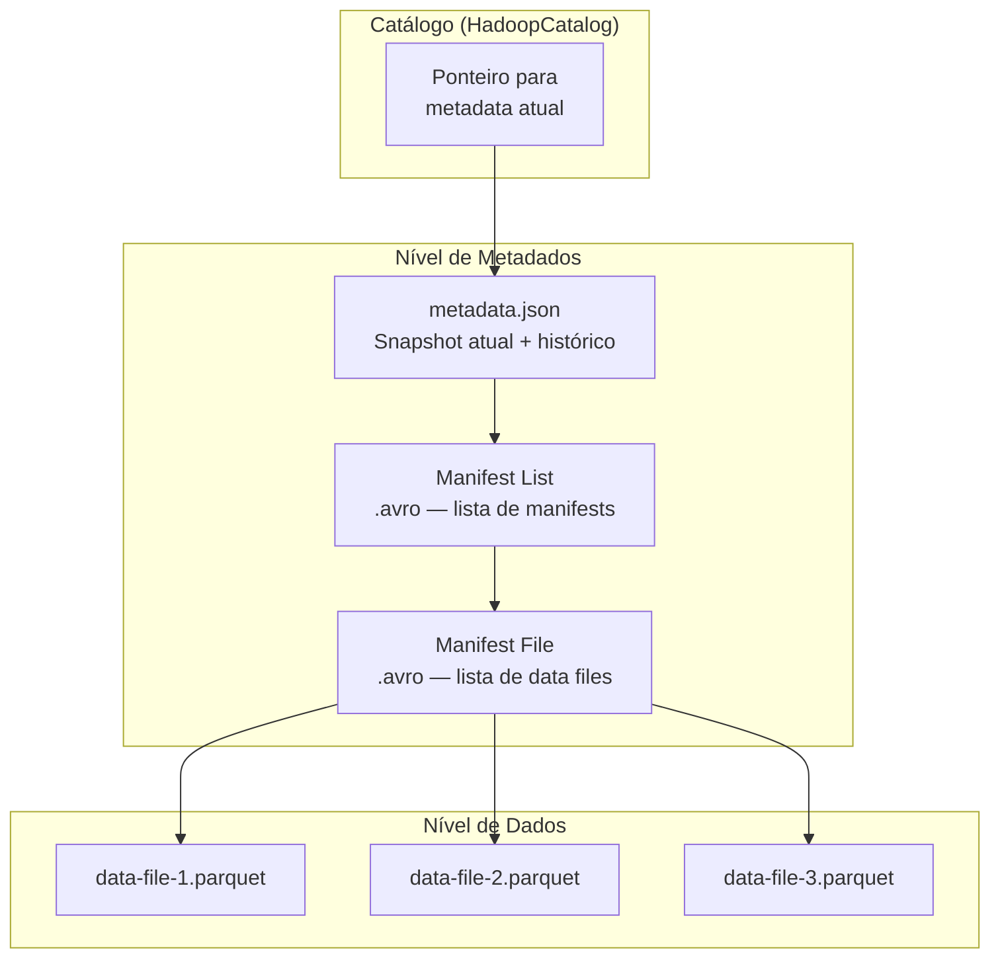

# Apache Iceberg

## O que é Apache Iceberg?

**Apache Iceberg** é um formato de tabela open-source de alto desempenho para data lakes analíticos, originalmente desenvolvido pela Netflix e doado à Apache Software Foundation em 2018. Iceberg resolve os problemas clássicos de tabelas Hive — como leituras inconsistentes durante escritas, particionamento problemático e falta de suporte a operações DML — através de uma camada de metadados rica e imutável.

!!! info "Versão utilizada neste projeto"
    **Iceberg Spark Runtime 1.5.0** para Spark 3.5 com Scala 2.12, usando **HadoopCatalog** com warehouse local em `/tmp/iceberg/warehouse`.

---

## Arquitetura de Metadados

A diferença fundamental do Iceberg em relação ao Parquet simples ou Hive é a sua **camada de metadados em três níveis**:



| Nível | Arquivo | Conteúdo |
|---|---|---|
| **Metadata** | `metadata.json` | Schema, particionamento, histórico de snapshots |
| **Manifest List** | `snap-*.avro` | Lista dos manifest files de um snapshot |
| **Manifest File** | `*.avro` | Lista dos data files com estatísticas de coluna |
| **Data Files** | `*.parquet` | Dados reais em formato Parquet |

Cada operação (INSERT, UPDATE, DELETE, MERGE) gera um novo **snapshot** — uma visão atômica e imutável da tabela — sem modificar os snapshots anteriores. Isso garante isolamento de leituras e permite time travel.

---

## Configuração da SparkSession

```python
import os
from pyspark.sql import SparkSession
from pyspark.sql.functions import col, to_date, current_timestamp, lit
from pyspark.sql.types import DoubleType

ICEBERG_WAREHOUSE = '/tmp/iceberg/warehouse'
DATA_PATH = os.path.abspath('../raw')

spark = (
    SparkSession.builder
    .appName('Pipeline_RH_Iceberg')
    # Extensão SQL: habilita UPDATE, DELETE, MERGE INTO, CALL, etc.
    .config('spark.sql.extensions',
            'org.apache.iceberg.spark.extensions.IcebergSparkSessionExtensions')
    # Catálogo nomeado 'local' — HadoopCatalog usa o sistema de arquivos diretamente
    .config('spark.sql.catalog.local', 'org.apache.iceberg.spark.SparkCatalog')
    .config('spark.sql.catalog.local.type', 'hadoop')
    .config('spark.sql.catalog.local.warehouse', ICEBERG_WAREHOUSE)
    # Runtime baixado via Maven na inicialização do Spark
    .config('spark.jars.packages',
            'org.apache.iceberg:iceberg-spark-runtime-3.5_2.12:1.5.0')
    .getOrCreate()
)

spark.sparkContext.setLogLevel('WARN')
```

---

## Namespaces (Databases)

No Iceberg, as tabelas são organizadas em **namespaces** — equivalentes a schemas ou databases. No projeto, usamos o namespace `rh` dentro do catálogo `local`:

```python
# Cria o namespace 'rh'
spark.sql('CREATE NAMESPACE IF NOT EXISTS local.rh')

# Lista namespaces disponíveis
spark.sql('SHOW NAMESPACES IN local').show()
```

```
+---------+
|namespace|
+---------+
|       rh|
+---------+
```

A convenção de endereçamento é `<catálogo>.<namespace>.<tabela>` — por exemplo: `local.rh.funcionarios`.

---

## DDL — Criação de Tabelas

O Iceberg exige (e recomenda) **schema explícito** via DDL, ao contrário do Delta onde é comum inferir a partir do DataFrame. Isso garante controle preciso sobre tipos e particionamento.

### Tabela de Funcionários

```sql
CREATE TABLE IF NOT EXISTS local.rh.funcionarios (
    funcionario_id  INT,
    nome            STRING,
    email           STRING,
    cpf             STRING,
    data_nascimento DATE,
    data_admissao   DATE,
    departamento_id INT,
    cargo_id        INT,
    salario         DOUBLE,
    status          STRING,
    pipeline_ts     TIMESTAMP,
    source          STRING
)
USING iceberg
PARTITIONED BY (status);
```

### Tabela de Folha de Pagamento

```sql
CREATE TABLE IF NOT EXISTS local.rh.folha_pagamento (
    folha_id             INT,
    funcionario_id       INT,
    competencia          STRING,
    salario_bruto        DOUBLE,
    desconto_inss        DOUBLE,
    desconto_irrf        DOUBLE,
    desconto_plano_saude DOUBLE,
    bonus                DOUBLE,
    salario_liquido      DOUBLE,
    data_pagamento       DATE,
    pipeline_ts          TIMESTAMP,
    source               STRING
)
USING iceberg
PARTITIONED BY (competencia);
```

---

## INSERT — Inserção de Dados

### Carga Inicial via `writeTo().append()`

O Iceberg usa a API `writeTo()` para gravar DataFrames diretamente em tabelas do catálogo:

```python
# Transformação: tipagem correta + metadados de pipeline
df_func_clean = (
    df_funcionarios
    .withColumn('data_nascimento', to_date(col('data_nascimento'), 'yyyy-MM-dd'))
    .withColumn('data_admissao',   to_date(col('data_admissao'),   'yyyy-MM-dd'))
    .withColumn('salario',         col('salario').cast(DoubleType()))
    .withColumn('pipeline_ts',     current_timestamp())
    .withColumn('source',          lit('CSV_LEGADO'))
)

# Seleciona apenas as colunas definidas no DDL — mesma ordem não é obrigatória
df_func_clean.select(
    'funcionario_id', 'nome', 'email', 'cpf',
    'data_nascimento', 'data_admissao', 'departamento_id',
    'cargo_id', 'salario', 'status', 'pipeline_ts', 'source'
).writeTo('local.rh.funcionarios').append()

print(f'Total: {spark.table("local.rh.funcionarios").count()} registros')
# Total: 15 registros
```

### Inserção via SQL

O Iceberg suporta `INSERT INTO` com valores literais, exatamente como SQL padrão:

```python
spark.sql("""
    INSERT INTO local.rh.funcionarios VALUES
    (16, 'Renata Gomes', 'renata.gomes@techcorp.com', '666.777.888-99',
     DATE '1998-04-12', DATE '2024-03-01', 1, 1, 5000.0, 'ATIVO',
     current_timestamp(), 'SISTEMA_RH_2024'),
    (17, 'Gustavo Prado', 'gustavo.prado@techcorp.com', '777.888.999-00',
     DATE '1990-09-27', DATE '2024-03-15', 3, 4, 10500.0, 'ATIVO',
     current_timestamp(), 'SISTEMA_RH_2024')
""")

total = spark.sql('SELECT COUNT(*) AS total FROM local.rh.funcionarios').collect()[0]['total']
print(f'✅ Total após INSERT SQL: {total}')
# ✅ Total após INSERT SQL: 17
```

### Resultado após INSERT

```python
spark.sql("""
    SELECT funcionario_id, nome, cargo_id, salario, status
    FROM local.rh.funcionarios
    ORDER BY funcionario_id
""").show()
```

```
+--------------+--------------------+--------+-------+------+
|funcionario_id|                nome|cargo_id|salario|status|
+--------------+--------------------+--------+-------+------+
|             1|     Ana Paula Silva|       3| 8500.0| ATIVO|
|             2|Carlos Eduardo Me...|       5|12000.0| ATIVO|
...
|            16|        Renata Gomes|       1| 5000.0| ATIVO|
|            17|       Gustavo Prado|       4|10500.0| ATIVO|
+--------------+--------------------+--------+-------+------+
```

---

## UPDATE — Atualização de Registros

O Iceberg suporta `UPDATE` direto via SQL desde a versão 0.14 com Spark 3.x. Não há API Python equivalente à `DeltaTable.update()` — tudo passa pelo SQL.

### Reajuste Salarial por Cargo

```python
spark.sql("""
    UPDATE local.rh.funcionarios
    SET salario     = salario * 1.12,
        pipeline_ts = current_timestamp()
    WHERE cargo_id = 2
    AND   status   = 'ATIVO'
""")

print('✅ Analistas Plenos: reajuste de 12%')
spark.sql("""
    SELECT nome, cargo_id, salario, status
    FROM local.rh.funcionarios
    WHERE cargo_id = 2
""").show()
```

```
+--------------+--------+-----------------+------+
|          nome|cargo_id|          salario|status|
+--------------+--------+-----------------+------+
|Fernanda Costa|       2|6944.000000000001| ATIVO|
|  Camila Souza|       2|7280.000000000001| ATIVO|
+--------------+--------+-----------------+------+
```

### Mudança de Status em Massa

```python
spark.sql("""
    UPDATE local.rh.funcionarios
    SET status      = 'DESLIGADO',
        pipeline_ts = current_timestamp()
    WHERE status = 'INATIVO'
""")

print('✅ Funcionários INATIVO → DESLIGADO')
spark.sql("""
    SELECT nome, status
    FROM local.rh.funcionarios
    WHERE status = 'DESLIGADO'
""").show()
```

```
+----------------+---------+
|            nome|   status|
+----------------+---------+
|Marcos Rodrigues|DESLIGADO|
|   Felipe Santos|DESLIGADO|
+----------------+---------+
```

!!! info "Como o UPDATE funciona no Iceberg"
    Assim como no Delta, o Iceberg **nunca modifica arquivos existentes**. Um `UPDATE` cria novos arquivos Parquet com as linhas modificadas e registra um novo **snapshot** nos metadados. Os arquivos antigos continuam existindo e são acessíveis via Time Travel.

---

## DELETE — Remoção de Registros

### Remoção por Predicado

```python
antes = spark.sql('SELECT COUNT(*) AS n FROM local.rh.funcionarios').collect()[0]['n']
print(f'Registros antes do DELETE: {antes}')  # 17

spark.sql("""
    DELETE FROM local.rh.funcionarios
    WHERE status = 'DESLIGADO'
""")

depois = spark.sql('SELECT COUNT(*) AS n FROM local.rh.funcionarios').collect()[0]['n']
print(f'Registros após o DELETE:   {depois}')  # 15
print(f'{antes - depois} registro(s) removido(s)!')
```

### DELETE com Filtro de Data e Origem

```python
# Remove registros de folha de competências antigas da fonte legada
spark.sql("""
    DELETE FROM local.rh.folha_pagamento
    WHERE source         = 'CSV_LEGADO'
    AND   data_pagamento  < DATE '2024-01-01'
""")
print('✅ Folhas legadas anteriores a 2024 removidas')
```

---

## MERGE INTO — UPSERT

`MERGE INTO` é a operação mais poderosa do Iceberg para pipelines incrementais. Em uma única instrução atômica, sincroniza dados entre uma fonte e a tabela destino.

```python
from pyspark.sql import Row
from datetime import date

# Dados chegando de uma API de RH em tempo real
dados_novos = [
    Row(funcionario_id=1, nome='Ana Paula Silva',   # (1)
        email='ana.paula@techcorp.com', cpf='123.456.789-01',
        data_nascimento=date(1990, 3, 15), data_admissao=date(2018, 6, 1),
        departamento_id=1, cargo_id=3, salario=9500.0,
        status='ATIVO', source='API_RH'),
    Row(funcionario_id=18, nome='Sofia Barros',     # (2)
        email='sofia.barros@techcorp.com', cpf='888.999.000-11',
        data_nascimento=date(2000, 6, 18), data_admissao=date(2024, 4, 1),
        departamento_id=4, cargo_id=1, salario=4800.0,
        status='ATIVO', source='API_RH'),
]

# Cria o DataFrame sem pipeline_ts (será adicionado com withColumn)
df_novos = (
    spark.createDataFrame(dados_novos)
    .withColumn('pipeline_ts', current_timestamp())
)

# Registra como view temporária para usar no SQL MERGE
df_novos.createOrReplaceTempView('source_rh')

# MERGE INTO: sintaxe SQL padrão ANSI
spark.sql("""
    MERGE INTO local.rh.funcionarios AS target
    USING source_rh AS source
    ON target.funcionario_id = source.funcionario_id
    WHEN MATCHED THEN
        UPDATE SET
            target.salario     = source.salario,
            target.email       = source.email,
            target.pipeline_ts = source.pipeline_ts
    WHEN NOT MATCHED THEN
        INSERT *
""")

total = spark.sql('SELECT COUNT(*) AS n FROM local.rh.funcionarios').collect()[0]['n']
print(f'✅ MERGE INTO executado! Total: {total} registros')
# ✅ MERGE INTO executado! Total: 16 registros
```

1. Funcionário **existente** (ID=1) — entra no `WHEN MATCHED → UPDATE SET`.
2. Funcionário **novo** (ID=18, Sofia Barros) — entra no `WHEN NOT MATCHED → INSERT *`.

!!! tip "Por que usar `createOrReplaceTempView`?"
    O `MERGE INTO` via SQL precisa de uma fonte nomeada. Registrar o DataFrame como view temporária é a forma padrão de disponibilizá-lo para o SQL sem precisar gravá-lo como tabela permanente.

---

## Time Travel e Snapshots

O Iceberg mantém um histórico de snapshots. Cada operação de escrita (INSERT, UPDATE, DELETE, MERGE) cria um novo snapshot.

### Listando Snapshots

```python
spark.sql("""
    SELECT snapshot_id, committed_at, operation, summary
    FROM local.rh.funcionarios.snapshots
""").show(truncate=False)
```

```
+-------------------+-------------------------+---------+-------------------+
|snapshot_id        |committed_at             |operation|summary            |
+-------------------+-------------------------+---------+-------------------+
|7392171067964535351|2026-04-29 00:37:49.748  |append   |{added-records->15}|
|8408425955796708354|2026-04-29 00:37:59.758  |append   |{added-records->2} |
|1888994734977160663|2026-04-29 00:38:03.079  |overwrite|{added-records->13}|
|7581888574623337620|2026-04-29 00:38:06.478  |overwrite|{added-records->2} |
|3606185790123978746|2026-04-29 00:38:09.486  |delete   |{deleted-records->2}|
|8606009116115671265|2026-04-29 00:43:58.547  |overwrite|{added-records->14}|
+-------------------+-------------------------+---------+-------------------+
```

### Lendo um Snapshot Específico

```python
# Coleta o snapshot_id do snapshot inicial
snapshots = spark.sql(
    'SELECT snapshot_id FROM local.rh.funcionarios.snapshots'
).collect()

primeiro_snapshot = snapshots[0]['snapshot_id']

# Lê os dados exatamente como estavam nesse snapshot
df_historico = spark.read \
    .option('snapshot-id', primeiro_snapshot) \
    .table('local.rh.funcionarios')

print(f'Snapshot inicial: {df_historico.count()} registros')
df_historico.select('nome', 'salario', 'status').show(5)
```

```
+--------------------+-------+-------+
|                nome|salario| status|
+--------------------+-------+-------+
|    Marcos Rodrigues| 9800.0|INATIVO|
|       Felipe Santos| 9500.0|INATIVO|
|     Ana Paula Silva| 8500.0|  ATIVO|
|Carlos Eduardo Me...|12000.0|  ATIVO|
|      Fernanda Costa| 6200.0|  ATIVO|
+--------------------+-------+-------+
```

---

## Schema Evolution — Evolução de Schema

Um dos diferenciais do Iceberg é a capacidade de **adicionar, renomear ou remover colunas sem reescrever os dados**. Os arquivos existentes continuam sendo lidos corretamente — a coluna nova retorna `NULL` para registros antigos.

```python
# Adiciona coluna nova sem reescrever a tabela
spark.sql("""
    ALTER TABLE local.rh.funcionarios
    ADD COLUMN data_desligamento DATE
""")

print('✅ Coluna adicionada!')
spark.sql('DESCRIBE local.rh.funcionarios').show(truncate=False)
```

```
+-----------------------+---------+-------+
|col_name               |data_type|comment|
+-----------------------+---------+-------+
|funcionario_id         |int      |NULL   |
|...                    |...      |NULL   |
|data_desligamento      |date     |NULL   |  ← nova coluna
|# Partition Information|         |       |
|status                 |string   |NULL   |
+-----------------------+---------+-------+
```

Outras operações de evolução de schema suportadas:

| Operação | SQL |
|---|---|
| Renomear coluna | `ALTER TABLE ... RENAME COLUMN old TO new` |
| Remover coluna | `ALTER TABLE ... DROP COLUMN nome` |
| Alterar tipo | `ALTER TABLE ... ALTER COLUMN nome TYPE novo_tipo` |
| Adicionar comentário | `ALTER TABLE ... ALTER COLUMN nome COMMENT '...'` |

!!! warning "Evolução de schema vs rewrite"
    `ADD COLUMN` e `RENAME COLUMN` são **metadata-only** — instantâneos, sem I/O de dados. Já `ALTER COLUMN ... TYPE` pode exigir reescrita se os tipos forem incompatíveis. Consulte a documentação do Iceberg para compatibilidade de tipos.
