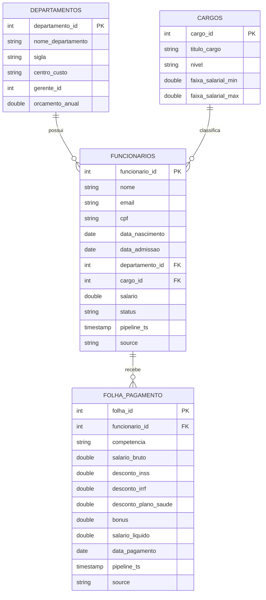
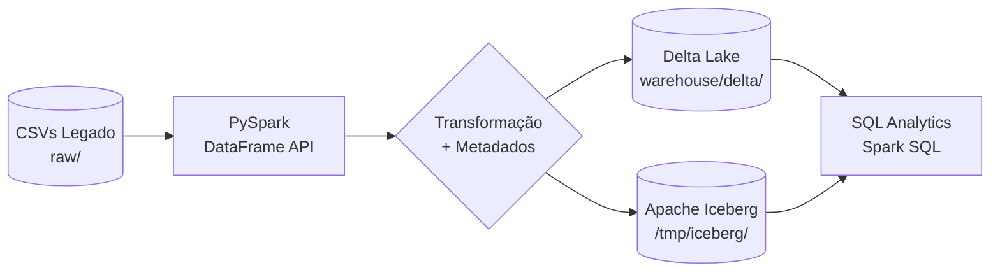

---
hide:
  - toc
---

# Contextualização do Projeto

## Cenário

A **TechCorp** é uma empresa de tecnologia de médio porte com aproximadamente 200 colaboradores distribuídos em quatro departamentos. O setor de RH mantinha seus dados em um sistema legado que exportava arquivos CSV mensalmente. O objetivo deste projeto é **migrar e modernizar essa pipeline de dados** utilizando formatos de tabela abertos — **Delta Lake** e **Apache Iceberg** — sobre o engine de processamento distribuído **Apache Spark (PySpark)**.

A pipeline implementa as operações fundamentais de qualquer plataforma de dados:

<div class="grid cards" markdown>

- :material-table-plus: **INSERT** — Carga inicial e incremental de dados
- :material-table-edit: **UPDATE** — Reajustes salariais e mudanças de status
- :material-table-remove: **DELETE** — Remoção de registros desligados
- :material-table-sync: **MERGE (UPSERT)** — Sincronização incremental via API de RH

</div>

---

## Fonte de Dados

A fonte primária são **quatro arquivos CSV** exportados do sistema legado de RH da TechCorp. Esses arquivos simulam dados reais de uma empresa de médio porte.

| Arquivo | Registros | Descrição |
|---|---|---|
| `funcionarios.csv` | 15 | Cadastro completo de colaboradores |
| `departamentos.csv` | 4 | Estrutura organizacional |
| `cargos.csv` | 7 | Plano de cargos e salários |
| `folha_pagamento.csv` | 26 | Folha de Jan e Fev/2024 |

Os arquivos ficam no diretório `raw/` e são lidos pelo Spark com inferência automática de schema:

```python
df_funcionarios = spark.read.csv(
    f'{DATA_PATH}/funcionarios.csv',
    header=True,
    inferSchema=True
)
```

!!! tip "Dados de exemplo"
    Os arquivos CSV representam dados fictícios criados exclusivamente para fins didáticos. Nenhuma informação real é utilizada.

---

## Modelo Entidade-Relacionamento

O modelo de dados é composto por quatro entidades com os seguintes relacionamentos:

- Um **departamento** possui vários funcionários (1:N)
- Um **cargo** classifica vários funcionários (1:N)
- Um **funcionário** possui várias entradas na **folha de pagamento** (1:N)



---

## DDL das Tabelas

O DDL abaixo define o schema completo das quatro tabelas. O mesmo schema é utilizado tanto no Delta Lake quanto no Iceberg — a diferença está no engine de armazenamento (`USING delta` vs `USING iceberg`).

=== "funcionarios"

    ```sql
    CREATE TABLE IF NOT EXISTS rh.funcionarios (
        funcionario_id  INT,
        nome            STRING,
        email           STRING,
        cpf             STRING,
        data_nascimento DATE,
        data_admissao   DATE,
        departamento_id INT,
        cargo_id        INT,
        salario         DOUBLE,
        status          STRING,   -- ATIVO | INATIVO | DESLIGADO
        pipeline_ts     TIMESTAMP,
        source          STRING
    )
    USING iceberg  -- ou: USING delta
    PARTITIONED BY (status);
    ```

=== "departamentos"

    ```sql
    CREATE TABLE IF NOT EXISTS rh.departamentos (
        departamento_id   INT,
        nome_departamento STRING,
        sigla             STRING,
        centro_custo      STRING,
        gerente_id        INT,
        orcamento_anual   DOUBLE,
        pipeline_ts       TIMESTAMP
    )
    USING iceberg;
    ```

=== "cargos"

    ```sql
    CREATE TABLE IF NOT EXISTS rh.cargos (
        cargo_id           INT,
        titulo_cargo       STRING,
        nivel              STRING,   -- JR | PL | SR | SP | CO | GE | DI
        faixa_salarial_min DOUBLE,
        faixa_salarial_max DOUBLE,
        pipeline_ts        TIMESTAMP
    )
    USING iceberg;
    ```

=== "folha_pagamento"

    ```sql
    CREATE TABLE IF NOT EXISTS rh.folha_pagamento (
        folha_id             INT,
        funcionario_id       INT,
        competencia          STRING,   -- formato: YYYY-MM
        salario_bruto        DOUBLE,
        desconto_inss        DOUBLE,
        desconto_irrf        DOUBLE,
        desconto_plano_saude DOUBLE,
        bonus                DOUBLE,
        salario_liquido      DOUBLE,
        data_pagamento       DATE,
        pipeline_ts          TIMESTAMP,
        source               STRING
    )
    USING iceberg
    PARTITIONED BY (competencia);
    ```

---

## Arquitetura da Pipeline



O fluxo completo:

1. **Extração** — leitura dos CSVs com `spark.read.csv(..., inferSchema=True)`
2. **Transformação** — conversão de tipos de data, cast de salário para `DoubleType`, adição de `pipeline_ts` e `source`
3. **Carga (INSERT)** — escrita inicial com `mode('overwrite')` no Delta e `writeTo().append()` no Iceberg
4. **Operações DML** — UPDATE, DELETE e MERGE executados via Spark SQL e APIs nativas
5. **Consulta** — relatórios analíticos com JOIN entre as tabelas
