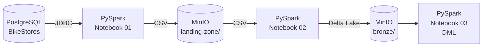
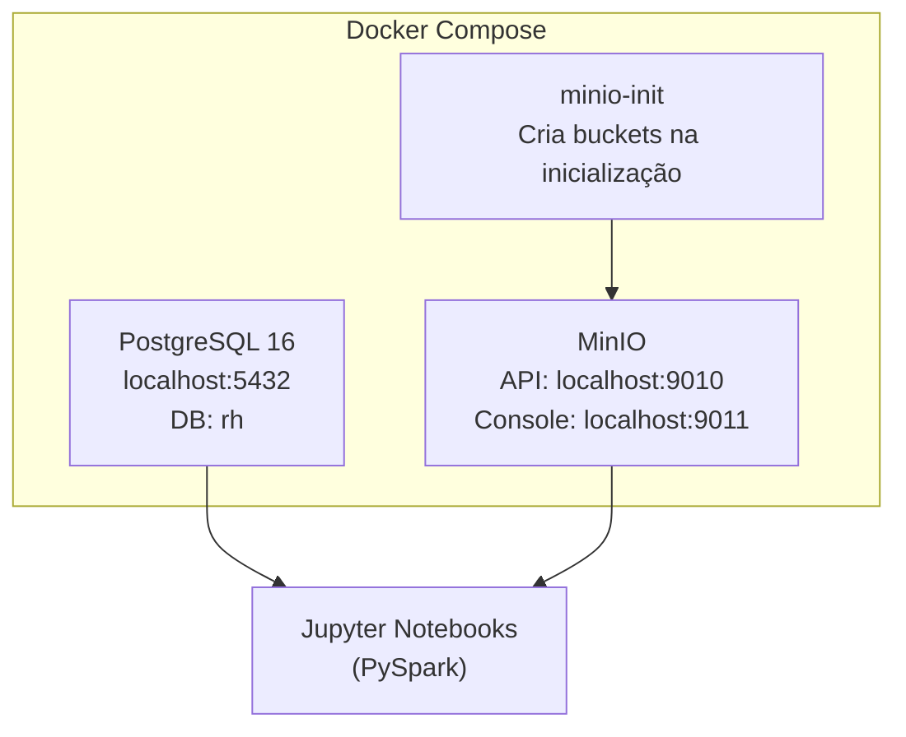
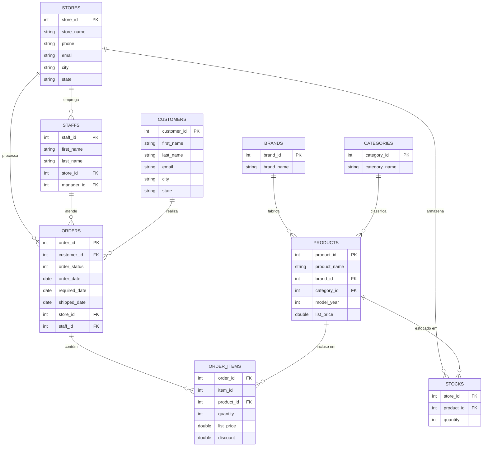

---
hide:
  - toc
---

# Contextualização do Projeto

## Cenário

A **BikeStores** é uma rede fictícia de lojas de bicicletas com três unidades físicas nos Estados Unidos. O objetivo deste projeto é construir uma **pipeline de dados moderna** que extrai os dados transacionais do banco PostgreSQL, os armazena em um Object Storage (MinIO) e os transforma em tabelas Delta Lake prontas para análise.

A pipeline implementa as operações fundamentais de qualquer plataforma de dados lakehouse:

<div class="grid cards" markdown>

- :material-table-plus: **INSERT** — Carga inicial e incremental de produtos e estoques
- :material-table-edit: **UPDATE** — Ajuste de preços e atualização de status de pedidos
- :material-table-remove: **DELETE** — Remoção de registros obsoletos
- :material-table-sync: **MERGE (UPSERT)** — Sincronização incremental de inventário via WMS

</div>

---

## Arquitetura da Pipeline



| Etapa | Notebook | Descrição |
|-------|----------|-----------|
| **Extração** | `01_extract_to_landing.ipynb` | Lê as 9 tabelas via JDBC e grava CSV no bucket `landing-zone` |
| **Conversão** | `02_landing_to_bronze.ipynb` | Lê os CSVs e converte para Delta Lake no bucket `bronze` |
| **DML** | `03_bronze_dml.ipynb` | INSERT, UPDATE, DELETE, MERGE e Time Travel no bronze |

---

## Infraestrutura



O PostgreSQL executa `bikestores.sql` automaticamente na **primeira inicialização do volume**, criando e populando todas as 9 tabelas.

!!! warning "Reinicializando o banco"
    O init script só roda quando o volume `postgres_data` está vazio. Para recriar o banco do zero:
    ```bash
    docker compose down -v   # apaga os volumes
    docker compose up -d     # sobe novamente e executa o SQL
    ```

**Credenciais:**

| Serviço | Usuário | Senha | Database |
|---------|---------|-------|----------|
| PostgreSQL | `engdados` | `engdados` | `rh` |
| MinIO | `minioadmin` | `minioadmin` | — |

---

## Fonte de Dados

O dataset **BikeStores** é composto por 9 tabelas que modelam o sistema de pedidos de uma rede de lojas de bicicletas.

| Tabela | Descrição |
|--------|-----------|
| `brands` | Marcas de bicicletas
| `categories` | Categorias de produtos
| `customers` | Cadastro de clientes
| `stores` | Lojas físicas
| `staffs` | Funcionários
| `products` | Catálogo de produtos
| `stocks` | Estoque por loja/produto
| `orders` | Pedidos de venda
| `order_items` | Itens de cada pedido

---

## Modelo Entidade-Relacionamento



!!! info "`order_status`"
    Os valores possíveis são: `1` = Pending, `2` = Processing, `3` = Rejected, `4` = Completed.
