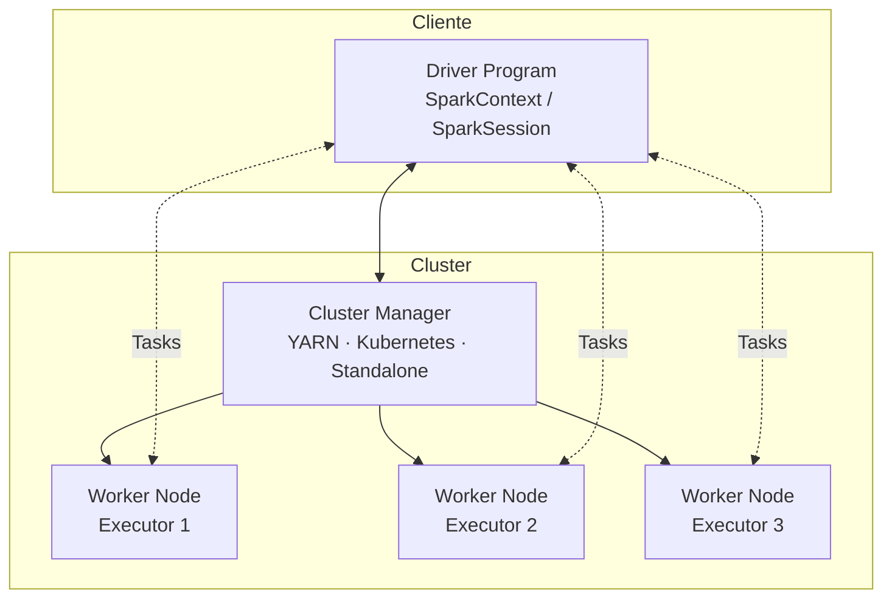

# Apache Spark e PySpark

## O que é o Apache Spark?

**Apache Spark** é um engine de processamento de dados em larga escala, open-source, criado na UC Berkeley em 2009 e doado à Apache Software Foundation em 2013. Ele processa dados **em memória** (in-memory), sendo até 100× mais rápido que o MapReduce para operações iterativas.

Spark não é um sistema de armazenamento — ele **processa** dados de fontes externas como HDFS, S3, bancos de dados relacionais, Kafka, e formatos de tabela aberta como **Delta Lake** e **Apache Iceberg**.

!!! info "Versão utilizada neste projeto"
    **Apache Spark 3.5.0** com **PySpark 3.5.0**, Delta Spark 3.1.0 e Iceberg Spark Runtime 1.5.0.

---

## Arquitetura

O Spark opera em um modelo **mestre/trabalhador** composto por três camadas:



| Componente | Papel |
|---|---|
| **Driver** | Ponto de entrada da aplicação. Cria o `SparkContext`, traduz o código do usuário em um plano de execução (DAG) e distribui *tasks* para os executors. |
| **Cluster Manager** | Aloca recursos no cluster. Pode ser YARN, Kubernetes, Mesos ou o modo Standalone. |
| **Executor** | Processo JVM que roda em cada Worker Node. Executa as *tasks* e mantém partições de dados em memória/disco. |

### Modo Local

Neste projeto, o Spark roda em **modo local** (`local[*]`), onde Driver e Executor são o mesmo processo JVM. Ideal para desenvolvimento e aprendizado — não requer um cluster real.

---

## Conceitos Fundamentais

### RDD vs DataFrame

| | RDD | DataFrame |
|---|---|---|
| **Nível** | Baixo (objetos Java/Python) | Alto (colunas tipadas) |
| **Otimização** | Manual | Automática via Catalyst |
| **API** | Funcional (map, filter, reduce) | SQL-like (select, filter, groupBy) |
| **Quando usar** | Transformações não estruturadas | Dados tabulares (99% dos casos) |

Este projeto usa exclusivamente **DataFrames**, que são a API moderna e recomendada do Spark.

### Lazy Evaluation

O Spark não executa transformações imediatamente. Ele constrói um grafo de operações (DAG) e só materializa o resultado quando uma **action** é chamada:

```python
# Transformações (lazy — não executam ainda)
df = spark.read.csv('funcionarios.csv', header=True, inferSchema=True)
df_ativos = df.filter("status = 'ATIVO'")
df_result = df_ativos.select('nome', 'salario')

# Action — aqui o Spark executa TODO o plano
df_result.show()        # dispara a execução
df_result.count()       # outra action
df_result.write.parquet(...)  # outra action
```

### Partições

O Spark distribui os dados em **partições** — fatias do DataFrame que podem ser processadas em paralelo por Executors diferentes. O particionamento físico é controlado por `.partitionBy()` na escrita:

```python
df.write.format('delta').partitionBy('status').save(path)
```

No Delta Lake e Iceberg, as partições são pastas no sistema de arquivos:
```
warehouse/delta/funcionarios/
├── status=ATIVO/
│   └── part-00000-....parquet
└── status=INATIVO/
    └── part-00000-....parquet
```

---

## SparkSession

`SparkSession` é o ponto de entrada único para todas as APIs do Spark desde a versão 2.0. Ela unifica `SQLContext`, `HiveContext` e `SparkContext`.

### Configuração do Projeto com Delta Lake

```python
from pyspark.sql import SparkSession
from delta import configure_spark_with_delta_pip

builder = (
    SparkSession.builder
    .appName('Pipeline_RH_DeltaLake')
    # Habilita a extensão SQL do Delta (MERGE, VACUUM, RESTORE, etc.)
    .config('spark.sql.extensions', 'io.delta.sql.DeltaSparkSessionExtension')
    # Substitui o catálogo padrão pelo catálogo Delta
    .config('spark.sql.catalog.spark_catalog', 'org.apache.spark.sql.delta.catalog.DeltaCatalog')
    # Diretório do warehouse — SEMPRE usar caminho absoluto
    .config('spark.sql.warehouse.dir', os.path.abspath('warehouse'))
)

spark = configure_spark_with_delta_pip(builder).getOrCreate()
```

### Configuração com Apache Iceberg

```python
ICEBERG_WAREHOUSE = '/tmp/iceberg/warehouse'

spark = (
    SparkSession.builder
    .appName('Pipeline_RH_Iceberg')
    # Extensão SQL do Iceberg (INSERT, UPDATE, DELETE, MERGE INTO)
    .config('spark.sql.extensions',
            'org.apache.iceberg.spark.extensions.IcebergSparkSessionExtensions')
    # Define o catálogo 'local' como um HadoopCatalog (sem Hive Metastore)
    .config('spark.sql.catalog.local', 'org.apache.iceberg.spark.SparkCatalog')
    .config('spark.sql.catalog.local.type', 'hadoop')
    .config('spark.sql.catalog.local.warehouse', ICEBERG_WAREHOUSE)
    # Baixa o runtime do Iceberg via Maven na inicialização
    .config('spark.jars.packages',
            'org.apache.iceberg:iceberg-spark-runtime-3.5_2.12:1.5.0')
    .getOrCreate()
)
```

!!! warning "`.getOrCreate()` e sessões existentes"
    Se uma `SparkSession` já existe no processo (ex: kernel Jupyter não reiniciado), `.getOrCreate()` **retorna a sessão existente e ignora todas as configs novas**. Sempre reinicie o kernel antes de mudar configurações de extensão.

---

## API PySpark — Operações Essenciais

### Leitura

```python
# CSV com inferência de schema
df = spark.read.csv('arquivo.csv', header=True, inferSchema=True)

# Delta Lake
df = spark.read.format('delta').load('/caminho/da/tabela')

# Iceberg
df = spark.table('local.rh.funcionarios')

# Delta com Time Travel
df = spark.read.format('delta').option('versionAsOf', 0).load('/caminho')
```

### Transformações Comuns

```python
from pyspark.sql.functions import col, to_date, current_timestamp, lit
from pyspark.sql.types import DoubleType

df_clean = (
    df
    .withColumn('data_admissao', to_date(col('data_admissao'), 'yyyy-MM-dd'))
    .withColumn('salario', col('salario').cast(DoubleType()))
    .withColumn('pipeline_ts', current_timestamp())
    .withColumn('source', lit('CSV_LEGADO'))
    .filter("status = 'ATIVO'")
    .select('funcionario_id', 'nome', 'salario', 'status', 'pipeline_ts', 'source')
)
```

### Escrita

```python
# Sobrescreve a tabela (carga inicial)
df.write.format('delta').mode('overwrite').partitionBy('status').save(path)

# Adiciona dados (carga incremental)
df.write.format('delta').mode('append').partitionBy('status').save(path)

# Iceberg
df.writeTo('local.rh.funcionarios').append()
```

### Spark SQL

O Spark permite escrever SQL diretamente sobre tabelas registradas no catálogo:

```python
# Registra um DataFrame como view temporária
df.createOrReplaceTempView('source_rh')

# Executa SQL sobre a view
resultado = spark.sql("""
    SELECT departamento_id, COUNT(*) as headcount, AVG(salario) as salario_medio
    FROM source_rh
    WHERE status = 'ATIVO'
    GROUP BY departamento_id
    ORDER BY salario_medio DESC
""")
resultado.show()
```

---

## Comparação: Delta Lake vs Apache Iceberg

| Característica | Delta Lake | Apache Iceberg |
|---|---|---|
| **Origem** | Databricks (open-sourced 2019) | Netflix (doado à Apache 2018) |
| **Transaction Log** | `_delta_log/` (JSON + Parquet checkpoint) | Metadata JSON + Manifest files |
| **SQL DML** | UPDATE, DELETE, MERGE via extensão | UPDATE, DELETE, MERGE via extensão |
| **Time Travel** | `versionAsOf`, `timestampAsOf` | `snapshot-id`, `as-of-timestamp` |
| **Schema Evolution** | `mergeSchema` option | `ALTER TABLE ADD/DROP COLUMN` |
| **Catálogo** | Spark Catalog (spark_catalog) | Iceberg Catalog (Hadoop, Hive, REST) |
| **Particionamento** | Explícito por coluna | Explícito ou Hidden Partitioning |
