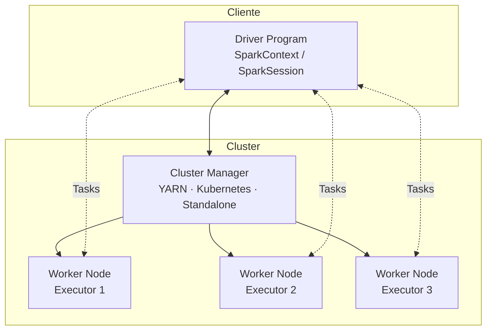

# Apache Spark e PySpark

## O que é o Apache Spark?

**Apache Spark** é um engine de processamento de dados em larga escala, open-source, criado na UC Berkeley em 2009 e doado à Apache Software Foundation em 2013. Ele processa dados **em memória** (in-memory), sendo até 100× mais rápido que o MapReduce para operações iterativas.

Spark não é um sistema de armazenamento — ele **processa** dados de fontes externas como S3, bancos de dados relacionais via JDBC, Kafka, e formatos de tabela aberta como **Delta Lake**.

!!! info "Versão utilizada neste projeto"
    **Apache Spark 3.5.0** com **PySpark 3.5.0** e **Delta Spark 3.1.0**.

---

## Arquitetura

O Spark opera em um modelo **mestre/trabalhador** composto por três camadas:



| Componente | Papel |
|---|---|
| **Driver** | Ponto de entrada da aplicação. Cria o `SparkContext`, traduz o código do usuário em um plano de execução (DAG) e distribui *tasks* para os executors. |
| **Cluster Manager** | Aloca recursos no cluster. Pode ser YARN, Kubernetes, Mesos ou o modo Standalone. |
| **Executor** | Processo JVM que roda em cada Worker Node. Executa as *tasks* e mantém partições de dados em memória/disco. |

### Modo Local

Neste projeto, o Spark roda em **modo local** (`local[*]`), onde Driver e Executor são o mesmo processo JVM. Ideal para desenvolvimento e aprendizado — não requer um cluster real.

---

## Conceitos Fundamentais

### RDD vs DataFrame

| | RDD | DataFrame |
|---|---|---|
| **Nível** | Baixo (objetos Java/Python) | Alto (colunas tipadas) |
| **Otimização** | Manual | Automática via Catalyst |
| **API** | Funcional (map, filter, reduce) | SQL-like (select, filter, groupBy) |
| **Quando usar** | Transformações não estruturadas | Dados tabulares (99% dos casos) |

Este projeto usa exclusivamente **DataFrames** e a **DataFrame API (Column API)**, que são a abordagem moderna e recomendada do Spark.

### Lazy Evaluation

O Spark não executa transformações imediatamente. Ele constrói um grafo de operações (DAG) e só materializa o resultado quando uma **action** é chamada:

```python
# Transformações (lazy — não executam ainda)
df = spark.read.format("delta").load(f"{BRONZE_BUCKET}/products")
df_2016 = df.filter(col("model_year") == 2016)
df_result = df_2016.select("product_id", "product_name", "list_price")

# Action — aqui o Spark executa TODO o plano
df_result.show()     # dispara a execução
df_result.count()    # outra action
```

### Partições

O Spark distribui os dados em **partições** — fatias do DataFrame processadas em paralelo. O particionamento físico no Delta Lake é controlado por `.partitionBy()` na escrita:

```python
df.write.format("delta").partitionBy("model_year").save(path)
```

Isso gera pastas no MinIO:
```
s3a://bronze/products/
├── model_year=2016/
│   └── part-00000-....parquet
├── model_year=2017/
│   └── part-00000-....parquet
└── model_year=2018/
    └── part-00000-....parquet
```

---

## SparkSession com Delta Lake e MinIO

`SparkSession` é o ponto de entrada único para todas as APIs do Spark. A configuração deste projeto conecta três sistemas: **Delta Lake**, **MinIO (S3A)** e, no notebook de extração, o **PostgreSQL via JDBC**.

### Notebook 01 — Extração (PostgreSQL + MinIO)

```python
from pyspark.sql import SparkSession
from delta import configure_spark_with_delta_pip

MINIO_ENDPOINT   = "http://localhost:9010"
MINIO_ACCESS_KEY = "minioadmin"
MINIO_SECRET_KEY = "minioadmin"

builder = (
    SparkSession.builder
    .appName("extract_to_landing")
    .config("spark.sql.extensions", "io.delta.sql.DeltaSparkSessionExtension")
    .config("spark.sql.catalog.spark_catalog", "org.apache.spark.sql.delta.catalog.DeltaCatalog")
    .config("spark.hadoop.fs.s3a.endpoint",               MINIO_ENDPOINT)
    .config("spark.hadoop.fs.s3a.access.key",             MINIO_ACCESS_KEY)
    .config("spark.hadoop.fs.s3a.secret.key",             MINIO_SECRET_KEY)
    .config("spark.hadoop.fs.s3a.path.style.access",      "true")
    .config("spark.hadoop.fs.s3a.impl",                   "org.apache.hadoop.fs.s3a.S3AFileSystem")
    .config("spark.hadoop.fs.s3a.connection.ssl.enabled", "false")
)

spark = configure_spark_with_delta_pip(
    builder,
    extra_packages=[
        "org.postgresql:postgresql:42.7.3",       # (1)
        "org.apache.hadoop:hadoop-aws:3.3.4",
        "com.amazonaws:aws-java-sdk-bundle:1.12.262",
    ],
).getOrCreate()
```

1. O driver JDBC do PostgreSQL precisa estar em `extra_packages` — **não** em `spark.jars.packages`, pois `configure_spark_with_delta_pip` sobrescreveria esse config.

### Notebooks 02 e 03 — Apenas MinIO

```python
spark = configure_spark_with_delta_pip(
    builder,
    extra_packages=[
        "org.apache.hadoop:hadoop-aws:3.3.4",
        "com.amazonaws:aws-java-sdk-bundle:1.12.262",
    ],
).getOrCreate()
```

!!! warning "`configure_spark_with_delta_pip` e `spark.jars.packages`"
    `configure_spark_with_delta_pip` chama `.config("spark.jars.packages", ...)` internamente para adicionar o Delta. Se você também setar `spark.jars.packages` no builder, a função **sobrescreve seu valor**. Use sempre `extra_packages` para adicionar JARs extras.

!!! warning "`.getOrCreate()` e sessões existentes"
    Se uma `SparkSession` já existe no kernel Jupyter, `.getOrCreate()` retorna a sessão existente e **ignora todas as configs novas**. Reinicie o kernel antes de alterar qualquer configuração.

---

## DataFrame API — Operações Essenciais

### Leitura

```python
# Via JDBC (PostgreSQL)
df = (
    spark.read
    .jdbc(url=JDBC_URL, table="products", properties=jdbc_props)
)

# CSV do MinIO (landing-zone)
df = (
    spark.read
    .option("header", "true")
    .option("inferSchema", "true")
    .csv("s3a://landing-zone/products")
)

# Delta Lake (bronze)
df = spark.read.format("delta").load("s3a://bronze/products")

# Delta com Time Travel
df = (
    spark.read
    .format("delta")
    .option("versionAsOf", 0)
    .load("s3a://bronze/products")
)
```

### Transformações

```python
from pyspark.sql.functions import col, current_timestamp, lit, round as spark_round
from pyspark.sql.types import IntegerType, DoubleType

df_clean = (
    df
    .withColumn("bronze_ingested_at", current_timestamp())
    .withColumn("source_system",      lit("postgres"))
    .withColumn("product_id",         col("product_id").cast(IntegerType()))
    .withColumn("list_price",         col("list_price").cast(DoubleType()))
    .filter(col("model_year") >= 2016)
    .select("product_id", "product_name", "brand_id", "model_year", "list_price")
)
```

### Escrita

```python
# Sobrescreve (carga inicial)
df.write.format("delta").mode("overwrite").partitionBy("model_year").save(path)

# Adiciona (carga incremental)
df.write.format("delta").mode("append").partitionBy("model_year").save(path)
```

---

## DataFrame API vs SQL cru

Este projeto adota a **DataFrame API** para todas as operações, evitando strings SQL. A vantagem é que os erros aparecem em tempo de execução com stack trace Python, e as expressões são verificáveis com autocomplete.

| Operação | SQL cru | DataFrame API |
|----------|---------|---------------|
| Filtro | `"status = 'ATIVO'"` | `col("status") == "ATIVO"` |
| Condição composta | `"a = 1 AND b IS NULL"` | `(col("a") == 1) & col("b").isNull()` |
| Expressão numérica | `"price * 0.85"` | `col("price") * 0.85` |
| Função | `"current_timestamp()"` | `current_timestamp()` |
| Arredondamento | `"ROUND(price, 2)"` | `spark_round(col("price"), 2)` |

Exemplo de UPDATE com DataFrame API via `DeltaTable`:

```python
from delta.tables import DeltaTable
from pyspark.sql.functions import col, current_timestamp
from pyspark.sql.functions import round as spark_round

delta_products = DeltaTable.forPath(spark, "s3a://bronze/products")

delta_products.update(
    condition=col("model_year") == 2016,
    set={
        "list_price":         spark_round(col("list_price") * 0.85, 2),
        "bronze_ingested_at": current_timestamp(),
    },
)
```
